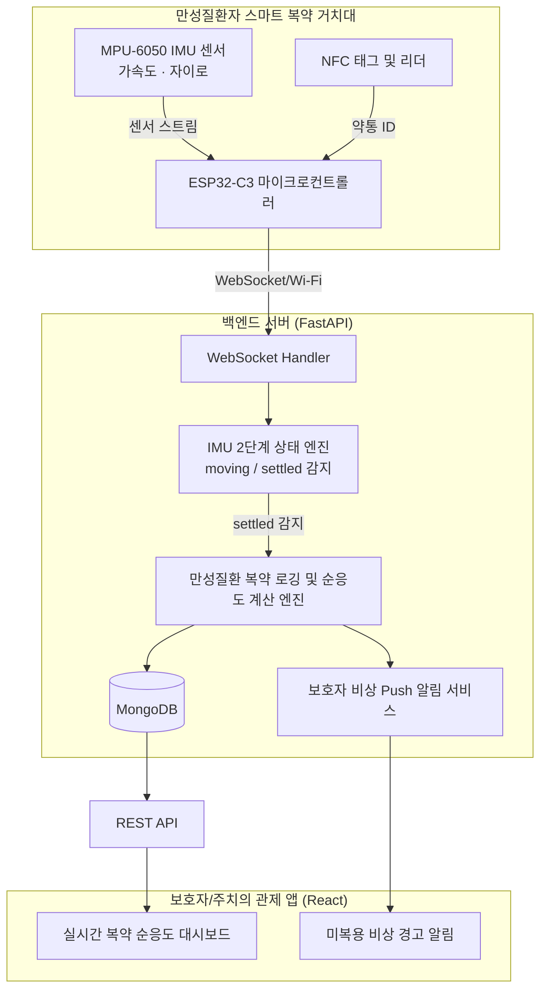

#  Hands-Free Med-Tracker (만성질환자 전용 자율형 복약 관리 솔루션)

> **노-터치 센서 기반 만성질환자 자율형 복약 추적 및 순응도 관리 시스템**

---

## 1. Overview (개요)

* **대상 (Target)**: **고혈압, 당뇨, 고지혈증, 심뇌혈관 질환 등 매일 정해진 시각에 정확히 약을 복용해야 하는 만성질환자** 및 이들을 관제하는 보호자/주치의.
* **핵심 가치 (Benefit)**: 스마트폰이나 전용 디바이스의 버튼 조작 **0회**. 약통을 들었다 내려놓는 일상적인 행동만으로 **복용 시각과 약통 종류가 자동 확인 및 기록**되는 극상의 편의성 제공.
* **제품 성격**: IMU 관성 센서 + NFC 융합 실시간 복약 데이터 에이전트.

---

## 2. Key Features (핵심 기능)

1. **자동 거치/움직임 감지 (`moving` ➔ `settled`)**:
   * IMU(가속도·자이로) 센서를 탑재하여 약통이나 약 상자를 들고 약을 꺼낸 뒤 다시 거치대에 내려놓는 순간을 초저지연 감지.
2. **NFC 기반 약통 자동 식별**:
   * 거치대와 약통 하단의 NFC 태그를 통해 '아침 혈압약', '저녁 당뇨약', '필요시 비상약' 등 약 종류를 100% 오인식 없이 판별.
3. **실시간 미복용 감지 & 보호자 비상 관제**:
   * 만성질환자의 복용 예정 시간을 초과할 경우 1차 거치대 소리/LED 알림 ➔ 2차 보호자 앱 비상 Push 알림 발송.
4. **만성질환 맞춤 복약 순응도(Medication Adherence) 대시보드**:
   * 주간/월간 복약 준수율 통계 및 혈압/당뇨 수치와 복약 시각 간의 상관관계 데이터를 주치의 진료 시 제공.

---

## 3. System Architecture & Data Flow (시스템 구조)

---

## 4. User Scenario: 만성질환자 실제 사용 시나리오

### 👤 페르소나 (Persona)
* **사용자**: 68세 김철수 님 (고혈압 및 2형 당뇨 만성질환 5년 차)
* **복약 루틴**: 아침 8:00 (혈압약 1종 + 당뇨약 1종), 저녁 19:00 (당뇨 2차약 1종)
* **보호자**: 떨어져 사는 딸 김수진 님 (보호자 관제 앱 설치)

---

### 🎬 시나리오 1: 아침 정시 복약 (정상 흐름)

1. **오전 08:00 (알림)**: 거치대 하단의 Soft LED 링이 은은한 초록색으로 켜지며 아침 복약 시각임을 안내합니다.
2. **오전 08:05 (약통 집어 듦)**: 김철수 님이 거치대 위의 **'아침 혈압약통'**을 손으로 집어 올립니다.
   * *센서 반응*: IMU 센서가 가속도/자이로 변화를 감지하여 상태를 `moving`(이동 중)으로 전이시킵니다.
3. **오전 08:06 (복용 및 거치)**: 약을 꺼내 물과 함께 복용한 후 약통을 거치대에 다시 내려놓습니다.
   * *센서 반응*: IMU 센서가 `settled`(거치됨)를 감지하는 순간, 거치대 NFC 리더가 약통 밑면 NFC 스티커를 스캔하여 **"아침 혈압약통"**으로 100% 확정합니다.
4. **오전 08:06 (자동 로깅 & 보호자 동기화)**:
   * 백엔드 서버에 `[08:06:12 / 김철수 / 아침 혈압약 / 정상 복용]` 이벤트가 영속화됩니다.
   * 출근길에 있던 딸 김수진 님의 스마트폰으로 **"아버님이 아침 혈압약을 정시에 복용하셨습니다 (08:06)"** 푸시 메시지가 도착하여 안심합니다.

---

### 🎬 시나리오 2: 저녁 복약 지연 및 미복용 비상 경고 (비상 예방 흐름)

1. **오후 19:00 (정기 복약 시간)**: 저녁 당뇨약 복용 시각이 되었으나, 김철수 님이 TV를 보느라 복약 시간을 깜빡합니다.
2. **오후 19:30 (1차 경고 - 30분 지연)**: 복용 시간이 30분 지나도 약통의 움직임(`settled` $\rightarrow$ `moving`)이 없자, 거치대에서 은은한 소리 부저 알림과 함께 주황색 LED가 점멸합니다.
3. **오후 20:00 (2차 비상 경고 - 1시간 미복용)**: 1시간이 지나도록 약통을 건드리지 않자 백엔드 미복용 예방 엔진이 발동합니다.
   * 딸 김수진 님의 스마트폰으로 **"⚠️ [비상] 아버님이 저녁 당뇨약을 1시간 동안 복용하지 않으셨습니다. 확인이 필요합니다."** 비상 경고 팝업이 전송됩니다.
4. **오후 20:02 (대처 및 복약 완료)**: 딸의 전화를 받은 김철수 님이 약을 복용하고 약통을 내려놓자, 거치대와 보호자 앱의 비상 경고 상태가 즉시 정상 해제됩니다.

---

### 🎬 시나리오 3: 정기 병원 진료 및 주치의 처방 조정 (데이터 활용 흐름)

1. **한 달 후 (병원 방문)**: 김철수 님이 내과 정기 진료를 위해 담당 주치의를 방문합니다.
2. **복약 순응도 데이터 제출**: 백엔드가 자동 생성한 **"최근 30일 복약 순응도 리포트 (준수율 96.7%, 평균 복용 오차 12분)"**가 주치의 대시보드로 전달됩니다.
3. **정밀 처방**: 주치의는 아버님이 약을 빠뜨리지 않고 정확한 시각에 복용하고 있음을 데이터를 통해 검증하고, 혈압/당뇨 수치 조절 경과에 따라 안심하고 약 용량을 정밀 조정합니다.

---

## 5. Hardware Requirements (요구 실물 부품)

| 부품명 | 대표 모델 | 역할 및 특징 |
| :--- | :--- | :--- |
| **IMU 관성 센서** | **MPU-6050** | 6축(가속도+자이로) 센서로 약통의 움직임과 내려놓음(`settled`) 감지 |
| **NFC 리더 모듈** | **PN532** (I2C) | 거치대에 내장되어 약통 하단 태그 식별 |
| **NFC 태그** | **NTAG213 / NTAG215** | 약통 밑면에 부착하는 저가형 스티커 태그 |
| **마이크로컨트롤러** | **ESP32-C3-SuperMini** | 초소형 Wi-Fi/BLE MCU로 센서 데이터 전송 |
| **배터리 & 충전** | **Li-Po 3.7V 500mAh + TP4056** | 거치대/약통 충전식 전원부 |

---

## 6. Feasibility & Value Proposition (현실적 적절성 및 차별성)

* **버튼 0회 UX**: 디지털 기기 사용이 불가능한 만성질환 고령자도 평소처럼 약만 꺼내 먹고 놓으면 자동으로 기록됨.
* **100% 식별 정확도**: NFC 기술 결합으로 기존 지자기 방식의 오인식(노이즈) 문제 완벽 해결.
* **낮은 하드웨어 비용**: 개당 수천 원 대의 MPU-6050 및 NFC 스티커로 구현 가능하여 상용화 가격 경쟁력 우수.
