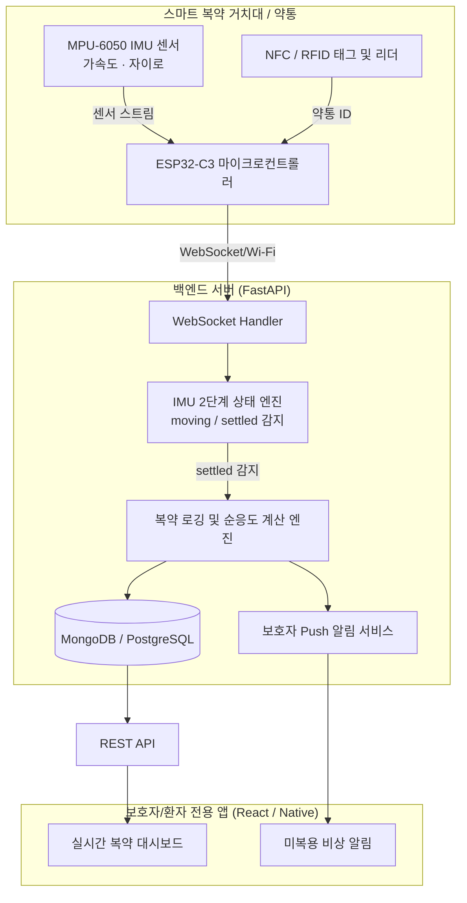

#  Hands-Free Med-Tracker (스마트 복약 관리 솔루션)

> **노-터치 센서 기반 고령자 및 만성질환자 자율형 복약 추적 시스템**

---

## 1. Overview (개요)

* **대상 (Target)**: 정기적인 복약이 필요하나 IT 기기 터치 조작이 어렵거나 건망증으로 복약을 놓치기 쉬운 고령자, 만성질환자, 및 이들을 케어하는 보호자/의료진.
* **핵심 가치 (Benefit)**: 스마트폰이나 전용 디바이스의 버튼 조작 **0회**. 약통을 들었다 내려놓는 일상적인 행동만으로 **복용 시각과 약통 종류가 자동 확인 및 기록**되는 극상의 편의성 제공.
* **제품 성격**: IMU 관성 센서 + NFC/RFID 융합 실시간 복약 데이터 에이전트.

---

## 2. Key Features (핵심 기능)

1. **자동 거치/움직임 감지 (`moving` ➔ `settled`)**:
   * IMU(가속도·자이로) 센서를 탑재하여 약통이나 약 상자를 들고 약을 꺼낸 뒤 다시 테이블/거치대에 내려놓는 순간을 초저지연 감지.
2. **NFC/RFID 기반 약통 자동 식별**:
   * 복약 거치대 바닥에 설치된 NFC 태그를 통해 '아침 약', '점심 약', '저녁 약' 또는 약통 종류를 100% 오인식 없이 식별.
3. **실시간 복약 알림 & 보호자 관제**:
   * 약 복용 예정 시간에 약통을 움직이지 않으면 거치대 LED/스피커 알림 발송.
   * 복용 예정 시간을 초과할 경우 보호자 앱으로 미복용 경고 Push 알림 전송.
4. **복약 순응도(Medication Adherence) 데이터 대시보드**:
   * 주간/월간 복약 준수율 통계 및 정확한 복용 시간대 데이터를 시각화하여 보호자 및 병원 진료 시 제공.

---

## 3. System Architecture & Data Flow (시스템 구조)

### 데이터 흐름 요약

1. **동작 수집**: 약통을 들면 IMU 센서가 `moving` 상태로 전이.
2. **거치 감지**: 약을 복용한 후 거치대에 놓으면 IMU가 `settled` 상태로 전이.
3. **약통 식별**: 거치대 하단의 NFC 리더가 약통 하단의 NFC 태그 ID를 100% 오차 없이 판별.
4. **자동 저장**: 백엔드 서버가 복용 시각 및 해당 약통 ID를 DB에 자동 기록.
5. **모니터링**: 보호자 앱 화면에 "어르신이 아침 약(혈압약)을 08:15분에 복용하셨습니다" 이벤트 실시간 업데이트.

---

## 4. Hardware Requirements (요구 실물 부품)

| 부품명 | 대표 모델 | 역할 및 특징 |
| :--- | :--- | :--- |
| **IMU 관성 센서** | **MPU-6050** | 6축(가속도+자이로) 센서로 약통의 움직임과 내려놓음(`settled`) 감지 |
| **NFC 리더 모듈** | **PN532** (I2C) | 거치대에 내장되어 약통 하단 태그 식별 |
| **NFC 태그** | **NTAG213 / NTAG215** | 약통 밑면에 부착하는 저가형 스티커 태그 |
| **마이크로컨트롤러** | **ESP32-C3-SuperMini** | 초소형 Wi-Fi/BLE MCU로 센서 데이터 전송 |
| **배터리 & 충전** | **Li-Po 3.7V 500mAh + TP4056** | 거치대/약통 충전식 전원부 |

---

## 5. Feasibility & Value Proposition (현실적 적절성 및 차별성)

* **버튼 0회 UX**: 디지털 기기 사용이 불가능한 중증 고령자도 평소처럼 약만 꺼내 먹고 놓으면 자동으로 기록됨.
* **100% 식별 정확도**: NFC 기술 결합으로 기존 지자기 방식의 오인식(노이즈) 문제 완벽 해결.
* **낮은 하드웨어 비용**: 개당 수천 원 대의 MPU-6050 및 NFC 스티커로 구현 가능하여 상용화 가격 경쟁력 우수.
