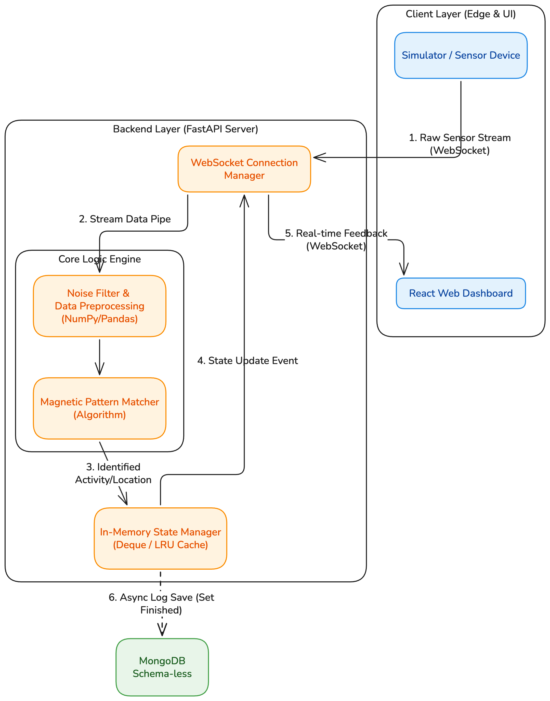
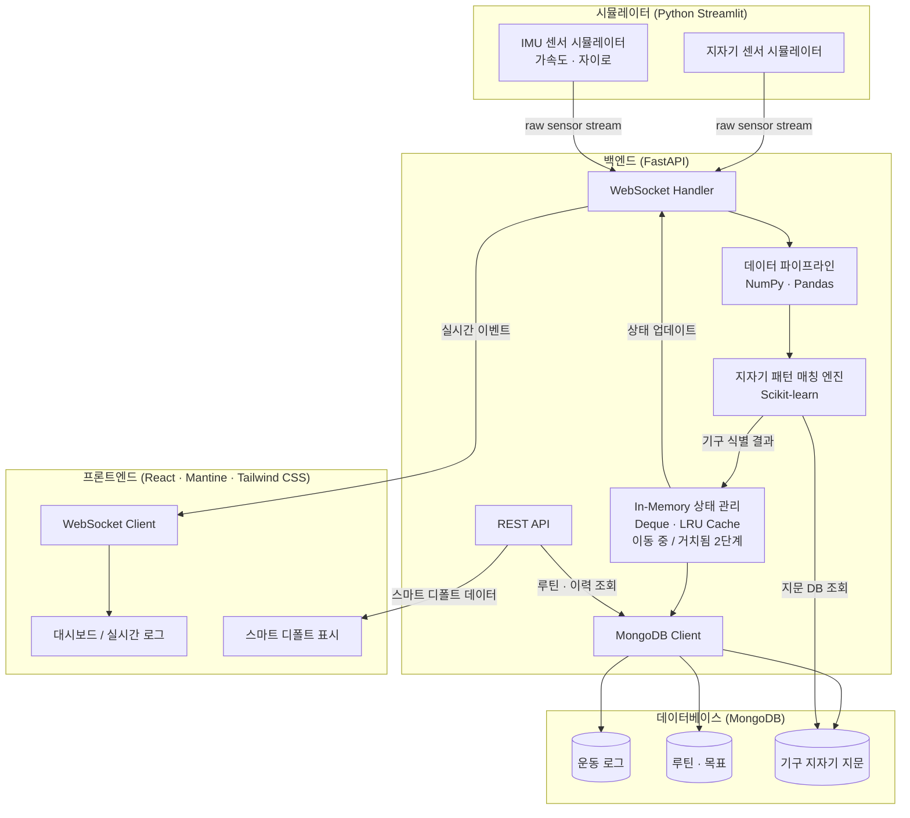

#  Hands-Free Gym Tracker

> **실시간 데이터 스트림 정제 기술 기반의 비접촉 운동 로깅 솔루션**

## Overview

* **대상(Target)** 기록의 번거로움보다 운동의 몰입을 우선시하며, 체계적인 데이터 관리를 원하는 웨이트 트레이너 및 애호가
* **핵심 가치(Benefit)** 스마트폰 조작 0회, 운동 흐름 끊김 없는 **'완전 자율형'** 운동 기록 경험 제공
* **제품 성격** 데이터 파이프라인 중심의 지능형 웹 에이전트 (Web-based Data Agent)
* **핵심 기능(Feature)** 
    - **텀블러 거치 기반 지자기 지문(Magnetic Fingerprinting) 인식**: 헬스장 기구별 고유한 금속 밀도와 배치에 따른 미세 자기장 왜곡을 인식하여, 텀블러를 내려놓는 순간 현재 위치한 기구를 오차 범위 50cm 이내로 식별.
    - **IMU 기반 2단계 텀블러 상태 감지**: 가속도·자이로 센서로 '이동 중(텀블러 이동 감지) / 거치됨(기구 점유)'의 2단계 상태를 구분. 텀블러 거치 후 사용자가 운동 중이든 휴식 중이든 센서 출력은 동일(~1.0g, 자이로≈0)하므로, 정확하게 구분 가능한 이 2단계 설계로 파이프라인을 구성.
    - **WebSocket 기반 초저지연 실시간 로깅**: 센서에서 발생하는 스트림 데이터를 WebSocket으로 처리하여 사용자가 텀블러를 놓음과 동시에 웹 UI가 즉각 반응하는 '노-터치' 인터페이스 구현.
    - **예측 기반 스마트 디폴트(Smart Default)**: 사용자의 과거 루틴과 현재 위치를 결합하여 "오늘의 레그 프레스 목표: 120kg, 12회"를 선제적으로 세팅.

## Technical Implementation

* **실시간 양방향 데이터 싱크**: 텀블러(시뮬레이터)에서 발생하는 미세한 물리적 변화를 초저지연 WebSocket으로 수신하고, 분석 결과를 사용자 화면에 즉각 반영하는 전이중(Full-duplex) 통신 구조 설계.
* **지능형 센서 데이터 정제 엔진**: `NumPy`와 `Pandas`  를 활용하여 유입된 센서 노이즈를 필터링하고, 지자기 패턴 매칭 알고리즘을 통해 90% 이상의 정확도로 기구 위치를 식별하는 FastAPI 기반 코어 로직 구축.
* **스키마리스(Schema-less) 운동 로그 모델링**: 기구마다 상이한 데이터 구조와 사용자별 가변적 루틴을 수용하기 위해 `MongoDB`를 채택, 유연한 데이터 확장성과 빠른 쓰기 성능 확보.
* **In-Memory 상태 관리 시스템**: 서버 내부의 효율적인 자료구조(`Deque`, `LRU Cache`)를 활용하여 외부 인프라 의존성을 줄이면서도 단일 노드 내에서 고속으로 사용자 상태를 추적하는 최적화 수행.

## Tech Stack

* **Frontend**: React, Mantine + Tailwind CSS (반응형 웹앱 — 모바일·데스크톱 동시 지원)
* **Backend**: FastAPI (Python)
* **Real-time**: WebSockets
* **Database**: MongoDB
* **Data Analysis**: NumPy, Pandas, Scikit-learn
* **Simulator**: Python Streamlit / Mocking Script

---

## Architecture




### 시스템 구성도



### 데이터 흐름 요약

1. **센서 수집**: 시뮬레이터가 지자기·IMU 센서 데이터를 WebSocket으로 전송
2. **정제 & 식별**: 파이프라인이 노이즈를 필터링하고 지자기 지문으로 기구 위치를 식별
3. **상태 갱신**: In-Memory 캐시로 텀블러의 현재 상태(이동 중 / 거치됨·기구 점유)를 실시간 추적 (운동 중/휴식 구분은 센서 범위 외)
4. **영속화**: 운동 로그와 루틴 데이터를 MongoDB에 저장
5. **UI 반영**: WebSocket 이벤트로 프론트엔드가 즉각 반응하여 노-터치 인터페이스 구현

---

## App Details

### 폴더 구조

```
handsfree-gym-tracker/
├── frontend/                              # React 반응형 웹앱
│   ├── public/
│   └── src/
│       ├── components/
│       │   ├── Dashboard.tsx              # 실시간 운동 로그 대시보드 (모바일·데스크톱 레이아웃)
│       │   ├── EquipmentStatus.tsx        # 현재 식별된 기구명 및 운동 상태 표시
│       │   ├── SmartDefault.tsx           # 스마트 디폴트 목표값 표시 및 수정
│       │   └── EquipmentRegisterModal.tsx # 신규 기구 지문 등록 모달
│       ├── hooks/
│       │   ├── useWebSocket.ts            # WebSocket 연결·재연결·이벤트 수신 관리
│       │   └── useWorkoutLog.ts           # 운동 로그 상태 및 REST 조회 관리
│       ├── api/
│       │   └── client.ts                  # REST API 클라이언트 (루틴·로그 조회)
│       ├── types/
│       │   └── index.ts                   # 공통 TypeScript 타입 정의
│       └── App.tsx                        # 라우팅 및 전역 WebSocket 컨텍스트 제공
│
├── backend/                               # FastAPI 서버
│   ├── main.py                            # 앱 진입점, CORS·라우터 등록
│   ├── websocket/
│   │   └── handler.py                     # WebSocket 연결 수락·브로드캐스트·재연결 처리
│   ├── pipeline/
│   │   ├── noise_filter.py                # NumPy 기반 지자기·IMU 노이즈 필터링
│   │   ├── mag_fingerprint.py             # Scikit-learn 기반 지자기 패턴 매칭 및 기구 식별
│   │   └── imu_state.py                   # 가속도·자이로 기반 사용자 상태 전이 감지
│   ├── state/
│   │   └── session_cache.py               # LRU Cache + Deque 기반 세션 상태 관리
│   ├── routers/
│   │   ├── log.py                         # 운동 로그 CRUD REST API
│   │   └── routine.py                     # 루틴 조회 및 스마트 디폴트 계산 API
│   └── db/
│       └── mongo_client.py                # MongoDB 연결 및 컬렉션 접근
│
├── simulator/                             # 센서 시뮬레이터
│   ├── streamlit_app.py                   # Streamlit UI (기구 선택, 노이즈 레벨, 상태 전이 제어)
│   ├── mag_simulator.py                   # 기구별 지자기 지문 패턴 데이터 생성
│   ├── imu_simulator.py                   # 상태별 IMU 데이터 생성 (이동·운동·휴식)
│   └── ws_emitter.py                      # 생성된 센서 데이터를 WebSocket으로 백엔드에 전송
```

